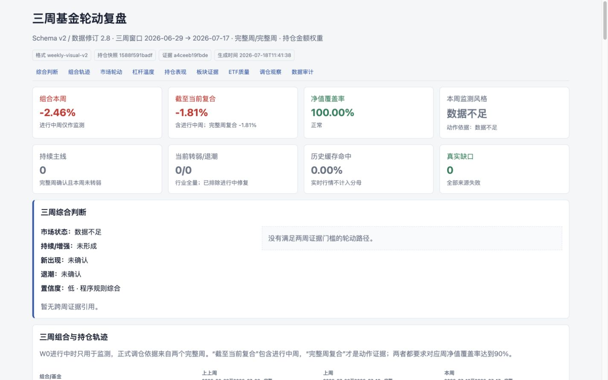

# Fund Rotation Analyst

一个面向中国公募基金组合的 Agent Skill 与独立 CLI。它把基金净值、风格指数、行业/概念资金流、ETF 交易质量和 A 股两融数据组织成可审计的三周轮动报告，并输出中文 JSON、Markdown 和响应式 HTML。

项目目前在 Codex 中开发和调试，并提供原生 `SKILL.md` 与 `agents/openai.yaml`；核心采集、分析、渲染和验证均为普通 Python CLI，不依赖 Codex 运行时。任何能够执行命令、读写 JSON 并展示 HTML 的 Agent 都可以调用，也可以只把它当作本地分析工具使用。

> 本项目只做研究与组合分析，不连接券商账户，不自动下单，也不构成投资建议。

## 能做什么

- 分析持仓基金的本周、近 1 月、近 3 月、最大回撤和组合贡献。
- 比较成长/价值、大盘/小盘、红利、科创、创业板等风格轨迹。
- 展示行业与概念近 5 个交易日收益 Top10、资金流入/流出 Top10。
- 使用 W0、W-1、W-2 三个非重叠交易周识别持续主线、加速、新启动、分歧和退潮。
- 区分主动基金、被动指数基金和 ETF 联接；展示规模、换手及持仓画像证据。
- 检查候选 ETF 的收益口径、成交额、收盘溢价、实时 IOPV 和交易可执行性。
- 评估 A 股融资杠杆密度、融资交易强度、杠杆热度与去杠杆压力。
- 对调仓建议执行评分覆盖、分差、主题重叠、流动性和溢价门控。
- 生成 `weekly-visual-v2` HTML，并用语义 Validator 阻止空榜或伪完整报告交付。

## 报告长什么样

示例输入见 [examples/holdings.sample.json](examples/holdings.sample.json)，脱敏演示报告见：

- [HTML 示例](examples/sample-report.html)
- [Markdown 示例](examples/sample-report.md)
- [分析 JSON 示例](examples/sample-analysis.json)



报告主要区块：

1. 组合 KPI 与三周综合判断
2. 三周组合、持仓和风格轨迹
3. A 股杠杆温度
4. 行业/概念三周轮动矩阵
5. 持仓表现和板块 Top10
6. ETF 交易质量与 Top3 门控
7. 缓存、数据质量和接口审计

## 给其他 Agent 使用

其他 Agent 不需要理解 Codex 的 Skill 元数据，只需按四段流水线调用：

```text
collect_weekly_data.py -> analyze_weekly.py -> render_weekly_report.py / render_weekly_visual_report.py -> validate_report.py
```

- 数值、日期边界、评分、动作和配比由 Python 脚本确定。
- Agent 可以解释 `weekly_llm_evidence.json`，但不得修改其中的数值、评分或动作。
- `SKILL.md` 是 Codex/OpenAI Agent 的封装入口；其他 Agent 可读取 [AGENTS.md](AGENTS.md) 或直接使用本 README 的 CLI 合同。
- CLI 不调用 OpenAI API，也不要求 Agent 使用特定模型或厂商。

## 安装

### 作为 Codex Skill 安装

```bash
git clone https://github.com/thincat75/fund-rotation-analyst.git \
  ~/.codex/skills/fund-rotation-analyst
cd ~/.codex/skills/fund-rotation-analyst
python3 -m venv .venv
.venv/bin/pip install -r requirements.txt
```

重启 Codex 后，可以直接说：

```text
使用 fund-rotation-analyst，读取我的 holdings.json，生成最近三周基金轮动报告。
```

### 作为普通 CLI 使用

```bash
git clone https://github.com/thincat75/fund-rotation-analyst.git
cd fund-rotation-analyst
python3 -m venv .venv
.venv/bin/pip install -r requirements.txt
```

Python 3.11+ 推荐；当前测试覆盖 Python 3.14。

## 五分钟开始

先运行完全离线的 mock 示例，不需要任何 key：

```bash
./examples/run_mock.sh
```

产物写入 `examples/generated/`。该流程用于验证环境和报告格式，不代表真实行情。

使用 AkShare 拉取公开数据，同样不需要 key：

```bash
.venv/bin/python scripts/collect_weekly_data.py \
  --holdings examples/holdings.sample.json \
  --output work/weekly_market_data.json \
  --mode quick \
  --history-weeks 3 \
  --margin-mode summary \
  --provider-policy akshare-only \
  --cache-root work/cache/fund-rotation

.venv/bin/python scripts/analyze_weekly.py \
  --holdings examples/holdings.sample.json \
  --weekly-data work/weekly_market_data.json \
  --output outputs/weekly_analysis.json \
  --history-weeks 3 \
  --cache-root work/cache/fund-rotation \
  --llm-evidence-output outputs/weekly_llm_evidence.json

.venv/bin/python scripts/render_weekly_report.py \
  --analysis outputs/weekly_analysis.json \
  --output outputs/weekly_report.md

.venv/bin/python scripts/render_weekly_visual_report.py \
  --weekly-data outputs/weekly_analysis.json \
  --output outputs/weekly_report.html

.venv/bin/python scripts/validate_report.py \
  --analysis outputs/weekly_analysis.json \
  --html outputs/weekly_report.html \
  --require-complete
```

`--require-complete` 会在行业/概念收益榜、流入榜、流出榜或其他强制区块缺失时退出失败。诊断型降级报告可以省略该参数，但不能称为完整报告。

## 持仓输入

支持按金额、明确权重或自动等权。金额和成本单位由用户自定义，但同一文件内必须一致。

```json
{
  "portfolio_meta": {
    "weight_mode": "amount",
    "weight_note": "示例金额，仅用于演示"
  },
  "holdings": [
    {
      "code": "000051",
      "name": "华夏沪深300ETF联接A",
      "amount": 40000,
      "cost": 38000,
      "is_core": true,
      "tags": ["宽基", "大盘"]
    }
  ]
}
```

字段说明：

| 字段 | 必需 | 含义 |
| --- | --- | --- |
| `code` | 是 | 六位基金代码 |
| `name` | 建议 | 基金名称；真实主题仍优先使用持仓和行业披露 |
| `amount` | 否 | 当前持仓金额，用于计算组合权重 |
| `current_weight` | 否 | 用户明确提供的权重，优先于 `amount` |
| `cost` | 否 | 持仓成本 |
| `is_core` | 否 | 是否为长期核心底仓 |
| `tags` | 否 | 用户标签，不替代公开披露证据 |

## 数据源与凭据

| 数据源 | 用途 | Key / Token | 默认启用 |
| --- | --- | --- | --- |
| AkShare | 基金净值、排行、持仓、指数、板块、ETF、交易所两融等公开数据聚合 | 不需要 | 是 |
| 东方财富、同花顺、新浪、腾讯、中证指数及交易所公开页面 | 由 AkShare 或本地适配器作为主源/备用源 | 通常不需要 | 按数据集 |
| HKEX Stock Connect eligible list | 核验 ETF 是否在沪股通/深股通合资格名单 | 不需要 | 按需 |
| Tushare Pro 官方 | 可选基金、指数、板块资金流、ETF、两融增强数据 | **需要在 Tushare 官网取得的 Pro token，并满足对应积分/接口权限** | 否，推荐的增强路径 |
| 第三方 Tushare 兼容代理 | 兼容部分 Tushare API 的备用来源 | **需要代理服务方自己的卡号/token，不是官方 Pro token** | 否，不推荐用于正式或无人值守运行 |
| OpenAI API | 不由 CLI 直接调用；Codex 可基于证据 JSON 做受约束解释 | 不需要额外 API key | 可选 |

### 推荐：官方 Tushare Pro

在 [Tushare Pro 官网](https://tushare.pro/) 注册并获取官方 token。不同接口可能需要相应积分或独立权限，具体以 [官方权限说明](https://tushare.pro/document/1?doc_id=290) 为准。

```bash
export TUSHARE_PROVIDER="official"
unset TUSHARE_HTTP_URL
read -s TUSHARE_TOKEN && export TUSHARE_TOKEN

.venv/bin/python examples/tushare_official_smoke.py
```

对应的官方 Python 调用方式是：

```python
import os
import tushare as ts

pro = ts.pro_api(os.environ["TUSHARE_TOKEN"])
d1 = pro.index_basic(limit=5)
d2 = ts.pro_bar(api=pro, ts_code="000001.SZ", limit=3)
print(d1)
print(d2)
```

代码不会修改 `pro._DataApi__http_url`，数据直接通过官方 SDK 获取。可先执行逐接口健康检查：

```bash
.venv/bin/python scripts/smoke_test_tushare.py \
  --provider official \
  --rounds 3 \
  --timeout 15 \
  --group all \
  --output work/tushare_official_health.json

.venv/bin/python scripts/collect_weekly_data.py \
  --holdings examples/holdings.sample.json \
  --output work/weekly_shadow.json \
  --provider-policy shadow \
  --tushare-health work/tushare_official_health.json
```

官方示例和 token 初始化方式见 [Tushare 官方调用文档](https://tushare.pro/document/1?doc_id=40)。

### 兼容选项：第三方 Tushare 代理

此前购买的便宜卡号属于第三方代理凭据，只能和该代理地址一起使用。它不是 Tushare 官网签发的 Pro token。只有你已确认代理服务方授权、数据来源和使用条款时才启用：

```bash
export TUSHARE_PROVIDER="third-party-proxy"
export TUSHARE_HTTP_URL="http://cheap-host1.cheapyun.com:24145"
read -s TUSHARE_TOKEN && export TUSHARE_TOKEN

.venv/bin/python scripts/smoke_test_tushare.py \
  --provider third-party-proxy \
  --rounds 3 \
  --timeout 15 \
  --group all \
  --output work/tushare_proxy_health.json
```

然后先运行 `shadow`，完成跨源核验后再使用 `auto`。示例成功不代表所有数据集均可靠，每个数据集必须独立晋级。

官方源和第三方代理必须使用各自独立的健康文件与 shadow 记录。程序会校验 provider mode 和 endpoint fingerprint，禁止用代理的晋级结果授权官方源，反之亦然。

正式使用建议选择官方 Tushare Pro，原因是账号权限、接口积分、服务条款和问题支持均可直接核验。第三方代理更适合短期隔离测试，不建议用于定期自动任务。

重要：不要把官方 Tushare Pro token 配置给第三方代理。该代理使用 HTTP，代理卡号和返回数据对代理运营方可见。不要把任何 token 写入代码、`.env`、报告、缓存、命令历史或 Issue；已经暴露的凭据必须先更换。

详细来源、单位、fallback 和缓存规则见 [references/data_sources.md](references/data_sources.md)。

## 缓存

共享增量数据库默认位于：

```text
work/cache/fund-rotation/cache.sqlite3
```

历史数据按 `provider + dataset + symbol + trade_date` 去重。闭市数据通过质量检查后复用；实时 ETF 快照使用 5 分钟 TTL。评分模型或 HTML 改动不会触发历史数据重新下载。

## 测试

```bash
.venv/bin/python -m unittest discover -s tests -v
```

验证 Skill 目录：

```bash
python ~/.codex/skills/.system/skill-creator/scripts/quick_validate.py .
```

## 安全与限制

- 不自动交易，不连接券商账户。
- Top30 和强势板块是候选证据，不是机械买入清单。
- 进行中周只能用于监测，正式动作至少需要两个完整周证据。
- 高两融余额不等于市场见顶，低两融余额也不等于上涨空间充足。
- 公开接口可能限流、改字段或暂停；报告会显示数据口径、截止日和降级状态。
- 主动基金持仓来自季度披露，不能当作实时持仓。

更多凭据处理建议见 [SECURITY.md](SECURITY.md)。

## License

[MIT](LICENSE)
